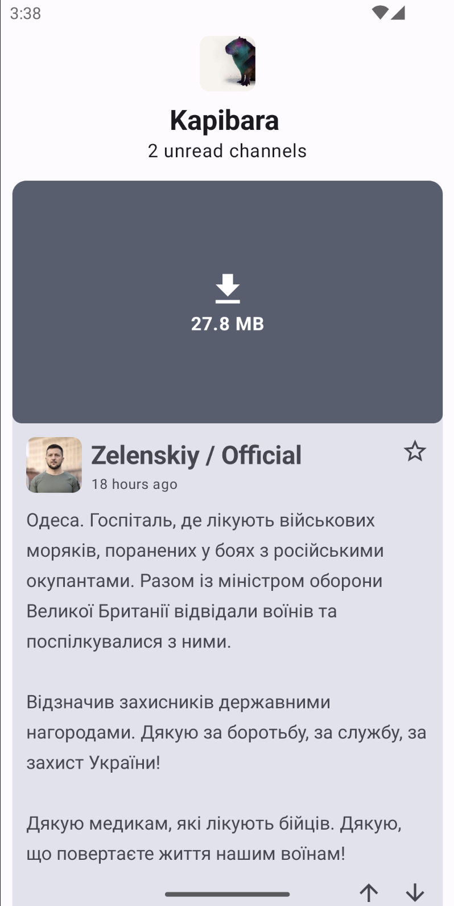
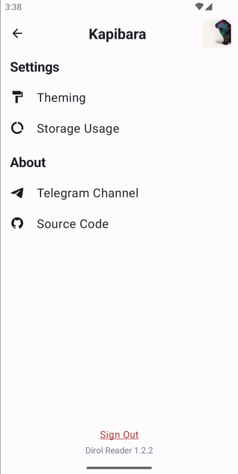

# :newspaper: Dirol-Reader
Introducing **Dirol Reader**, a cutting-edge Android app designed to revolutionize your news reading experience. Powered by advanced algorithms and built with user preferences in mind, **Dirol Reader** leverages the **TdLib (Telegram Database Library)** to curate a relevance-based news feed from your favorite channels' posts, keeping you informed and engaged.

# Screenshots
### Feed screen

### Prfile screen

# Basic features
- One feed with all unread channels' posts
- Ability to star channel and like/dislike post. This allow you to choose what do you want to read first.

# Supported message types
- :white_check_mark: MessageText
- :white_check_mark: MessageAnimation
- :white_check_mark: MessageAudio
- :white_check_mark: MessageDocument (only caption)
- :white_check_mark: MessagePhoto
- :white_check_mark: MessageSticker (animated is unsupported)
- :white_check_mark: MessageVideo
- :white_check_mark: MessageVideoNote
- :white_check_mark: MessageVoiceNote
- :x: MessageLocation
- :x: MessageVenue
- :x: MessageContact
- :x: MessageAnimatedEmoji
- :x: MessageDice
- :x: MessageGame
- :x: MessagePoll

Message with premium emoji is coming as unsupported type.

I'm not sure that all of them really needed.

# Plans
Right now I'm working on improving the overall quality of the code base. Then will focus on the new features and support for more message types.
